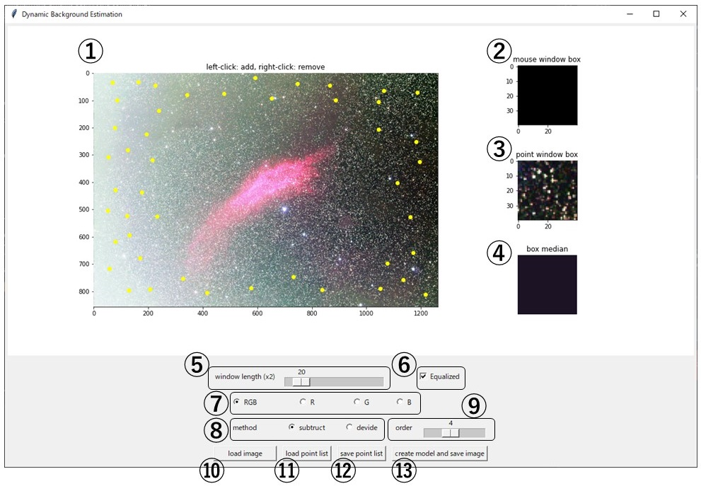

# DynamicBackgroundEstimation GUI 説明書

このテキストでは、本プログラムのGUI利用方法について説明します。

## 操作画面説明

### 各部名称

1. 画像表示／ポイント選択ウインドウ
    - モデル推定したい画像が表示されます
    - 右クリックでポイント指定、左クリックでポイント削除
2. マウスオーバーウインドウ
    - 1にマウスポインタが乗っている場合に、マウスオーバーしている領域の拡大像が表示されます
3. ポイントウインドウ
    - 最新のポイントの領域画像が表示されます
4. ポイントウインドウ（中央値）
    - 3で表示されている画像の中央値が表示されます
    - この中央値はモデル推定の際に使用されます
5. ウインドウサイズ設定
    - 2, 3, 4の表示サイズを設定できます
    - モデル推定の際の中央値をポイントを基準にどれぐらいの範囲で取るかを設定します
6. ヒストグラム平均化設定
    - チェックを入れることで表示画像に対しヒストグラム平均化フィルターがかかります
    - モデル推定には影響を与えません
    - カブリがどの領域に存在するのかを見やすくするために使用します
7. 表示カラーチャンネル設定
    - RGB, R, G, Bのいずれかを選択し、表示画像のチャンネルを変更します
8. 補正方式設定
    - 推定したモデルを使用した元画像への補正方法を設定します
    - 「subtract（減算）」「divide（除算）」のいずれかが選択可能です
9. フィッティング関数設定（option）
    - フィッティング関数の次元数を変更できます（デフォルトは4次関数）
10. 画像データ読み込み
    - モデルを推定したい画像を読み込みます
    - 対応形式は「tiff（16bit,32bit）」「fits（16bit,32bit）」
11. ポイントリスト読み込み
    - 過去に保存したポイントリスト（npy形式）を読み込みます
12. ポイントリスト保存
    - 指定したポイントをリスト（.npy）として書きだします
13. モデル推定・画像出力
    - 設定にしたがってモデルの推定・出力、元画像の補正・結果出力を行います

## 操作方法
1. ⑩を押してダイアログを開き、モデルを推定したい画像を読み込みます
2. ①に表示された画像に対してポイントを指定します
    - 恒星や星雲が多い領域はなるべく避けて、背景情報が多い領域を選択します
        - 恒星や星雲が多い領域を選択すると、うまく背景モデルを推定できません
    - ②、③を見ながら背景情報の多いポイントを指定していくと効果的です
    - ④でモデル推定に使用する指定ポイントの中央値情報が表示されるので、③と④との間で乖離がないかも確認するとより効果的です
        - あまりにもかけ離れている場合は背景情報がうまく抽出できていない可能性があります
    - ⑤のスライダーを動かすことでポイントのウインドウサイズを変更できます
3. ⑧より補正方式を設定します（「subtract（減算）」または「divide（除算）」）
    - カブリ補正には「subtract」、フラット補正には「divide」を使用するのがベターです
4. （Option）⑨よりモデル推定に使用するフィッティング関数を設定します
    - 次元数が増えるほどより複雑なモデルを推定しますが、オーバーフィッティングになる可能性があります
    - カブリ補正には4次関数が、フラット補正には2次関数がおすすめです
5. （Option）⑫を押して指定したポイントを保存します
6. ⑬を押して背景モデルの推定を行います
    1. 補正後の画像の保存先を指定します
        - 補正後の画像を「output.fits」としたとき、推定モデルは「output_model.fits」として同ディレクトリに自動で保存されます
        - Errorが出た場合はウインドウの指示にしたがって設定等を見直してください
    2. モデルの推定が完了すると、保存形式を指定するダイアログが表示されるので、保存形式を選択します
        - 拡張子は読み込み画像と同じ（tiff or fits）です
        - 形式は「16bit integer（整数）」「32bit integer（整数）」「32bit rational（実数）」です